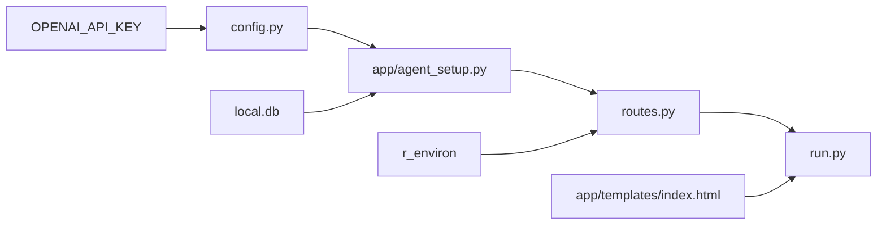

# CDx AI
Version beta v0.01

## Description
Building a LLM interface for CDx development

## Structure

### Component Descriptions

1. **`run.py`**:
   - The entry point of the application. It initializes the Flask app and starts the server. It pulls everything together, ensuring that the routes, configurations, and other components are correctly loaded and operational.

2. **`app/templates/index.html`**:
   - This is the frontend template that serves as the user interface. It provides a form for users to input their queries and displays the responses returned by the application. This HTML file is rendered by Flask when users access the root URL.

3. **`app/routes.py`**:
   - Contains the Flask route definitions and the logic to handle incoming HTTP requests. It processes user queries, interacts with the R environment for sample size calculations, and handles calls to the LLM-based agents. It serves as the middle layer that coordinates between user input, processing, and output.

4. **`app/agent_setup.py`**:
   - Handles the creation and storage of vector indexes used for querying documents. It interacts with external storage (e.g., local databases) to save and load these indexes. It’s also responsible for setting up tools that the agents use to process user queries.

5. **`r_environ`**:
   - Represents the R environment, including any R scripts or Plumber APIs that are called by the application. This is where R-based calculations, like sample size determination, are executed based on user queries passed from `routes.py`.

6. **`config.py`**:
   - Contains configuration settings for the application, such as the OpenAI API key. This file centralizes settings that might change between environments (e.g., development, testing, production).

7. **`local.db`**:
   - Represents the local database or storage system where document indexes and other persistent data are stored. This file is used by `agent_setup.py` to save and retrieve indexes that the application uses to process document-related queries.

8. **`OPENAI_API_KEY`**:
   - An environment variable or a configuration entry that holds the API key for accessing OpenAI services. This key is retrieved by `config.py` and used by the application to interact with OpenAI's API, enabling natural language processing and other AI-powered functionalities.

